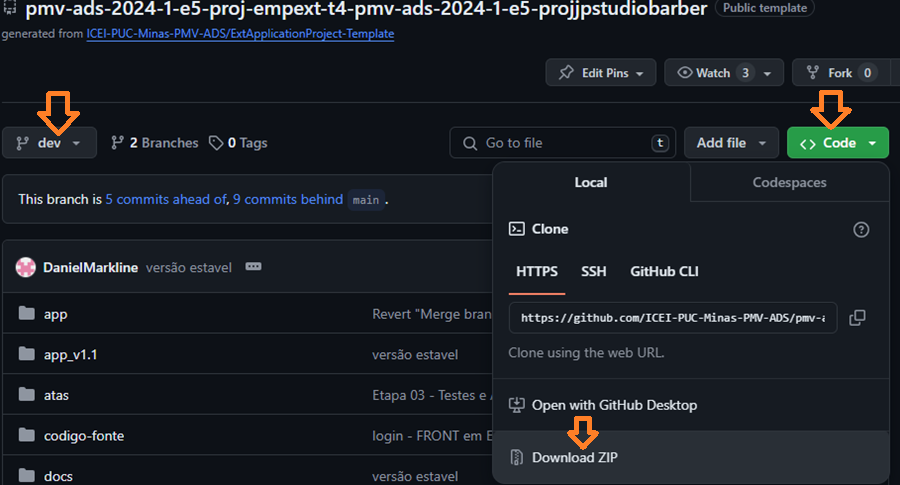
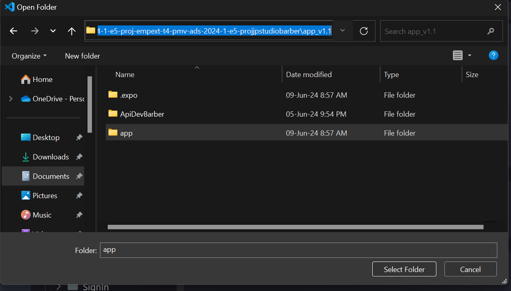
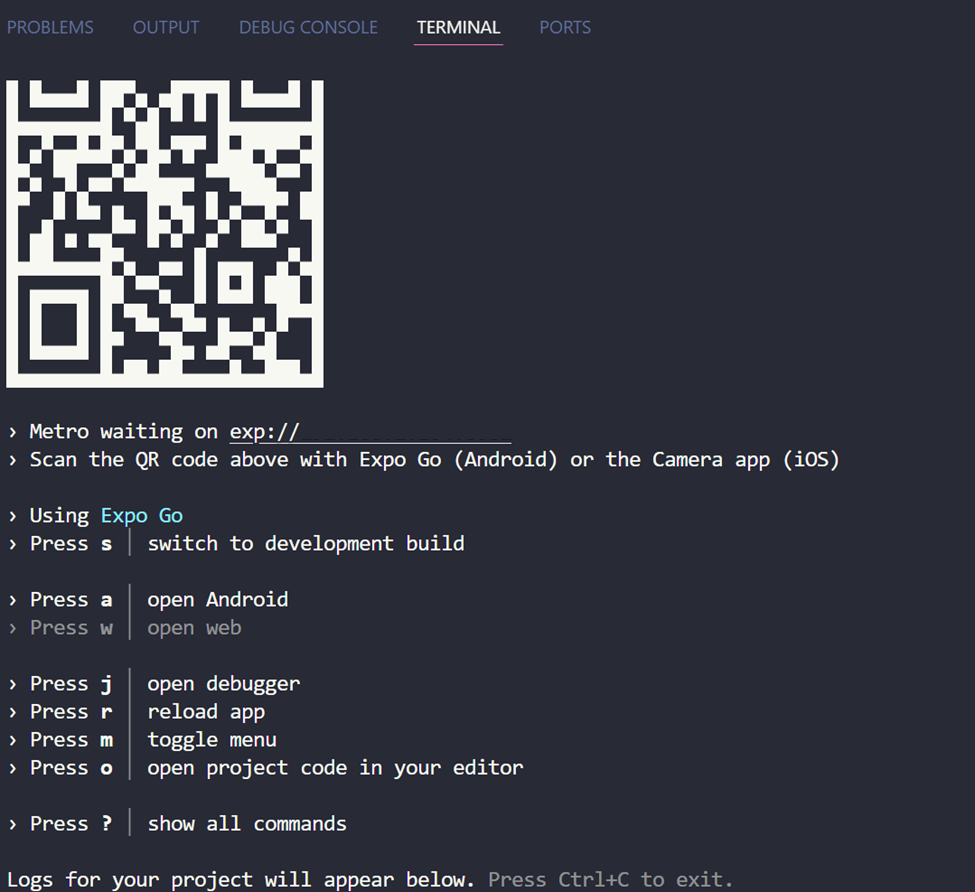

# JP STUDIO BARBER

`CURSO: Análise e Desenvolvimento de Sistema - EAD`

`DISCIPLINA: Projeto: Desenvolvimento de um Sistema Sociotécnico Inovador`

`SEMESTRE: Eixo 5`

O projeto envolve o desenvolvimento de um sistema de agendamentos on-line para a empresa JP Barber localizada en Nova Lima - MG, onde o profissional Jonatas realiza os atendimentos de serviços de barbearia em geral, para sua cartela de clientes já consolidada. Isso promoverá a otimização no fluxo de agendamento, na organização da agenda e na centralização de informações do estabelecimentos. Alem ainda de possibilitar o maior engajamento junto aos seus clientes e permitir um ambiente de acompanhamento dos agendamentos tanto para o Jonatas, quanto para os clientes.

## Integrantes

* Armando Xavier de Amorim
* Daniel de Souza Marcolino
* Gabriel Costa de Cerqueira Bispo
* Maykon Edésio Rosa
* Roger Bastos Mendes

## Orientador

* João Carlos Oliveira Caetano

# Instruções de utilização

Abaixo, seguem as instruções para rodar o projeto localmente:

## 1. Fazer o download do arquivo do projeto (ZIP) da branch "dev"

<figure>
    
</figure>

## 2. Instalar o Visual Studio Code

[Download do Visual Studio Code](https://code.visualstudio.com/download)

## 3. Instalar Node.js c/ o NPM

[Download do Node.js Package Manager](https://nodejs.org/en/download/package-manager)

## 4. Instalar o Android Studio

[Download do Android Studio](https://developer.android.com/studio?hl=pt-br)

## 5. Após descompactar a pasta do projeto JP Studio, abrir o VS Code

ir em "Arquivo -\> Abrir Diretório", selecionando a pasta dentro do
repositório: "\... 2024-1-e5-projjpstudiobarber\\app_v1.1\\app"

<figure>
    
</figure>

## 6. Abrir um novo terminal no VS Code (Terminal -\> Novo Terminal) e

#### Executar os seguintes comandos:

**Para instalar todas as dependências necessárias do projeto:** `NPM INSTALL`

**Para rodar a aplicação:** `NPX EXPO START`

## 7. Seguir as instruções do Metro conforme opção selecionada

<figure>
    
</figure>

## 8. PASSO A PASSO PARA GERAR O ARQUIVO APK DO ANDROID

#### 8.1. Todos os comandos devem ser utilizados dentro da pasta onde o projeto está localizado, no caso deste projeto será no seguinte caminho:

`.\pmv-ads-2024-1-e5-proj-empext-t4-pmv-ads-2024-1-e5-projjpstudiobarber\app_v1.1\app`

#### 8.2. INSTALAR O EXPO

**COMANDO:** `npm install expo`

#### 8.3. INSTALAR O EAS-CLI

**COMANDO:** `npm install -g eas-cli`

#### 8.4. GERAR UMA KEYSTORE

**COMADO:** `keytool -genkeypair -v -keystore my-release-key.jks -keyalg RSA -keysize 2048 -validity 10000 -alias my-key-alias`

Irá aparecer as solicitações abaixo:

Enter keystore password:  
Re-enter new password:  
Enter the distinguished name. Provide a single dot (.) to leave a sub-component empty or press ENTER to use the default  
  
What is your first and last name? (Preencher o primeiro e último nome)  
  [Unknown]:  Armando Amorim  
What is the name of your organizational unit? (Nome da unidade organizacional)  
  [Unknown]:  JP Studio Barber  
What is the name of your organization? (Nome da organização)  
  [Unknown]:  JP Studio Barber  
What is the name of your City or Locality? (Cidade)  
  [Unknown]:  Belo Horizonte  
What is the name of your State or Province? (Estado)  
  [Unknown]:  Minas Gerais  
What is the two-letter country code for this unit?  
  [Unknown]:  MG  
Is CN=Armando Amorim, OU=JP Studio Barber, O=JP Studio Barber, L=Belo Horizonte, ST=Minas Gerais, C=MG correct?  
  [no]:  yes

Generating 2.048 bit RSA key pair and self-signed certificate (SHA384withRSA) with a validity of 10.000 days
for: CN=Armando Amorim, OU=JP Studio Barber, O=JP Studio Barber, L=Belo Horizonte, ST=Minas Gerais, C=MG  
[Storing my-release-key.jks]

#### 8.5. INICIAR O PROCESSO DE BUILD

**OBS: ANTES DE INICIAR ESTE PROCESSO, É NECESSÁRIO CRIAR UMA CONTA NA EXPO, CASO NÃO TENHA, CRIE UMA PARA DAR SEQUENCIA, CONFORME ABAIXO.**

[Link para acessar o Expo](https://expo.dev/)

**COMANDO:** `eas build -p android --profile production`

Ao executar este comandos pela primeira vez, uma sequencia de solicitações irá se iniciar, para acessar a conta da expo e pedindo informações da keystore gerada.
  
An Expo user account is required to proceed.
Log in to EAS with email or username (exit and run eas login --help to see other login options)  
  
√ Email or username ... armando1182  
√ Password ... ********  
√ Would you like to automatically create an EAS project for @armando1182/app? ... yes  
√ Path to the Keystore file. ... `C:\pmv-ads-2024-1-e5-proj-empext-t4-pmv-ads-2024-1-e5-projjpstudiobarber\app_v1.1\app\my-release-key.jks` **(este caminho irá variar de acordo com a máquina de cada um)**  
√ Keystore password ... ********  
√ Key alias ... verificar no arquivo da keystore gerada  
√ Key password ... ********  

**OBS: PARA VERIFICAR O ALIAS DA KEY GERADA, VERIFIQUE ATRAVÉS DO COMANDO ABAIXO, SERÁ EXIBIDO NO CAMPO "ALIAS NAME"**

`keytool -list -v -keystore + [caminho da keystore gerada]`

**OBS: Se todos os passos forem executados de forma satisfatória o processo de criação do arquivo apk irá se iniciar, para acompanhar o build, acesse o site do expo com o usuário criado anteriormente e no menu lateral, ao logar, clique em "Builds". Ao final do processo irá habilitar o botão para download do arquivo.**

## Documentação

<ol>
<li><a href="docs/01-Documentação de Contexto.md"> Documentação de Contexto</a></li>
<li><a href="docs/02-Especificação do Projeto.md"> Especificação do Projeto</a></li>
<li><a href="docs/03-Projeto de Interface.md"> Projeto de Interface</a></li>
<li><a href="docs/04-Plano de Testes de Software.md">Plano de Testes de Software</a></li>
<li><a href="docs/05-Registro de Teste de Software.md">Registro de Testes de Software</a></li>
<li><a href="docs/06-Implantação.md"> Implantação</a></li>
</ol>

# Código

<li><a href="codigo-fonte/README.md"> Código Fonte</a></li>

# Apresentação

<li><a href="presentation/README.md"> Apresentação da solução</a></li>
