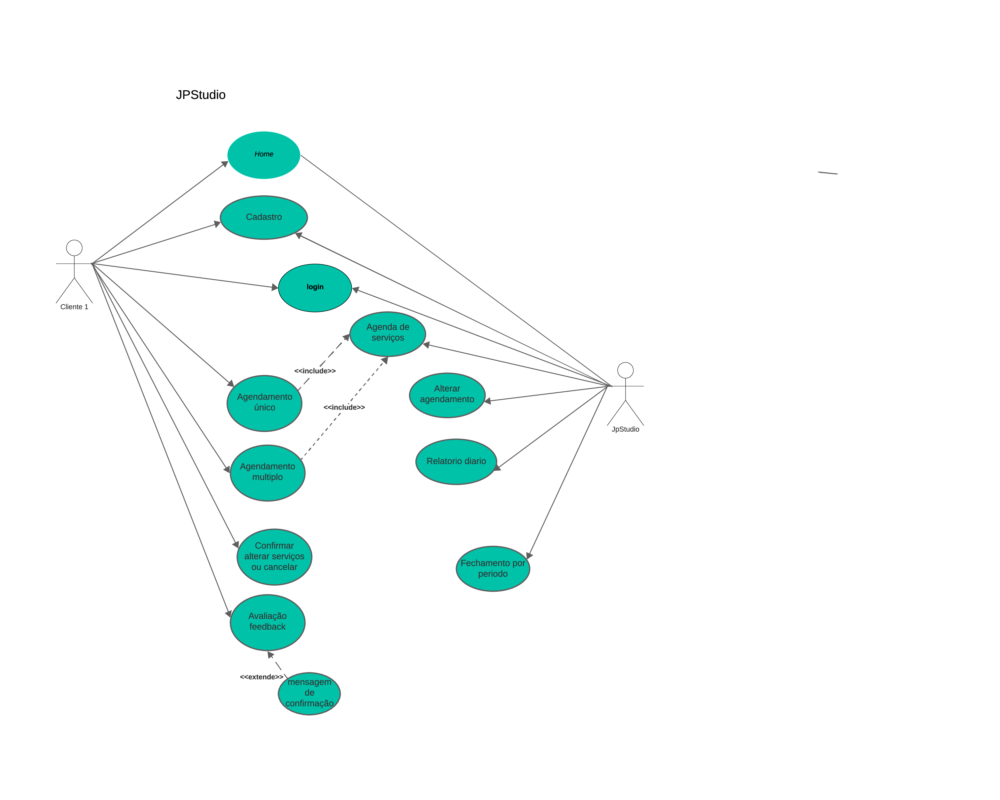
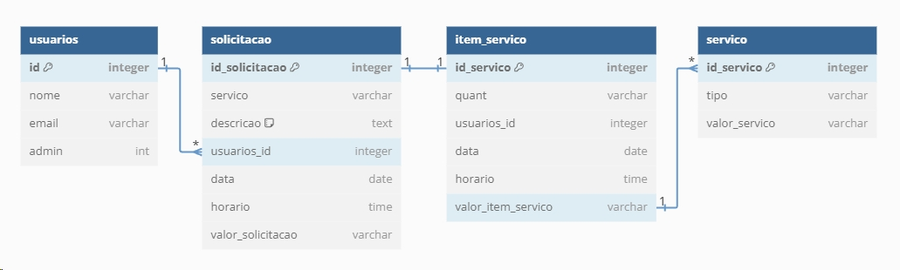

# Especificações do Projeto

Pré-requisitos: <a href="1-Documentação de Contexto.md"> Documentação de Contexto</a>

Definição do problema e ideia de solução a partir da perspectiva do cliente. Os pontos mais relevantes observados durante as discussões foram então consolidados a seguir.

## Arquitetura e Tecnologias

O projeto será desenvolvido utilizando as seguintes tecnologias:

- Front-End: A interface do usuario será desenvolvida utilizando CSS, ReactJS
- Back-End: Todo o aparato de back-end será desenvolvido em React Native

As tecnologias escolhidas foram as mais adequadas para atender os requisitos do projeto, que são:

- Facilidade de uso: Dos clientes atuais e futuros do negócio
- Acessibilidade: Maior base instalada de usuários
- Eficiencia: Publicação em loja de aplicativos, podendo efetuar um agendamento a qualquer momento.

## Project Model Canvas

## Requisitos

As tabelas que se seguem apresentam os requisitos funcionais e não funcionais que detalham o escopo do projeto.
Foi utilizado a técnica de priorização da Matriz MoSCOW.

### Requisitos Funcionais

|ID    | Descrição do Requisito  | Prioridade |
|------|-----------------------------------------|----|
|RF-001| A aplicação deverá permitir o cadastro de usuários (Cliente e Admin).| ALTA | 
|RF-002| A aplicação deve ter opção de login para seus usuários, mediante a senha, com acessos diferenciados entre Cliente e Admin. | ALTA |
|RF-003| A aplicação deve exibir um botão "Agendamento" na <i>landing page</i> para acesso da função de seleção de data, horários e serviços disponíveis. | ALTA |
|RF-004| A aplicação deverá permitir que o Admin faça o cancelamento, edição ou alteração dos agendamentos. | ALTA |
|RF-005| A aplicação deve permitir que o Cliente faça mais de um agendamento. | MÉDIA |
|RF-006| A aplicação deve permitir que o Cliente faça o cancelamento ou alteração do serviço agendado. | ALTA | (Removido a pedido Cliente)
|RF-007| A aplicação deve permitir a avaliação dos serviços realizados pelo Cliente. | MÉDIA |
|RF-008| A aplicação deverá permitir o agendamento de serviços para o Cliente, somente com uma antecedência minima de 1 hora. | MÉDIA |
|RF-009| A aplicação deverá enviar um alerta de confirmação do serviço agendado. | BAIXA |
|RF-010| A aplicação deverá emitir um relatório por período com o valor total dos serviços executados. | BAIXA |

### Requisitos não Funcionais

|ID     | Descrição do Requisito  |Prioridade |
|-------|-------------------------|----|
|RNF-001| A aplicação deverá ser responsiva permitindo a visualização em um smartphone de forma adequada. |  ALTA | 
|RNF-002| A aplicação deve ser publicada em loja de aplicativos Google Play Store.|  ALTA |
|RNF-003| A aplicação deve estar de acordo com a Lei Geral de Proteção de Dados (LGPD).|  ALTA |
|RNF-004| A aplicação deverá fazer a encriptação de senha dos usuários.|  ALTA |
|RNF-005| A aplicação deverá ter índice de disponibilidade superior a 99%.|  MÉDIA |
|RNF-006| A aplicação deverá possuir backup de segurança automático em nuvem. |  MÉDIA |

## Restrições

O projeto está restrito pelos itens apresentados na tabela a seguir.

|ID| Restrição                                             |
|--|-------------------------------------------------------|
|RE-001| O projeto deverá ser entregue até o dia 23-JUN-24. |
|RE-002| A equipe não poderá subcontratar o desenvolvimento do trabalho.       |
|RE-003| A aplicação terá como foco dispositivos com sistema operacional Android.|

## Diagrama de Casos de Uso

O diagrama de casos de uso é o próximo passo após a elicitação de requisitos.

## Modelo ER (Projeto Conceitual)

O Modelo ER representa através de um diagrama como as entidades (coisas, objetos) se relacionam entre si na aplicação interativa.

## Projeto da Base de Dados

O projeto da base de dados corresponde à representação das entidades e relacionamentos identificadas no Modelo ER.

