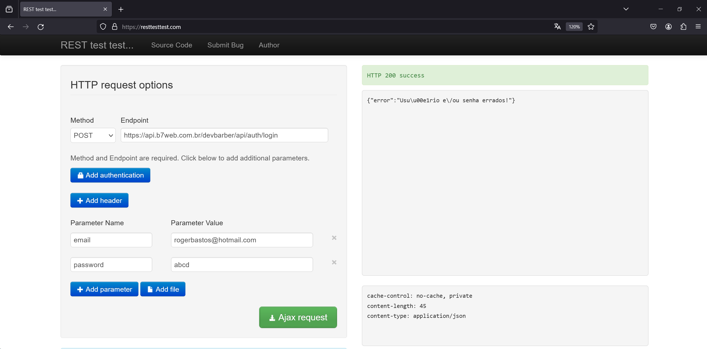
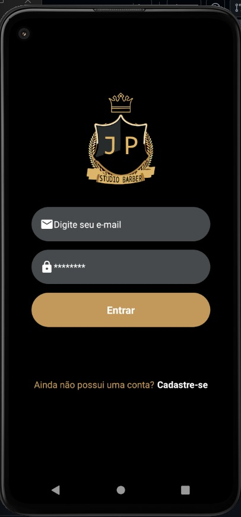
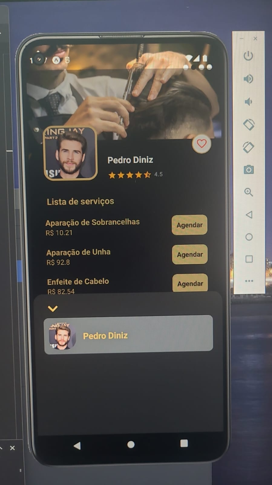

# Planos de Testes de Software

## FRONT END: API
 
 ### 1 - Login/Cadastro
  
**1.1 - Verificar se o cadastro email já cadastrado na plataforma**
   - Obejetivo: Verificar se o metodo create da API está funcionando de forma correta
   - Passos: Acessar o Rest Test e preencher os campos solicitados 
   - Criterio: Retorno do código 200 e caso o email já estejá cadastrado, uma mensagem de alerta será exibido

**1.2 - Verificar se cadastro está sendo realizado sem nenhum problema**
   - Obejetivo: Ter certeza que todos os dados estão sendo enviado de maneira corrreta
   - Passos: Acessar o Rest Test e preencher os campos solicitados
   - Criterio: Retorno do código 200 e mensagem do cadastro do usuário e token com sucesso

**1.3 - Verificar se o  sistema deixa somente usuario cadastrados entrar na plataforma**
   - Obejetivo: Verificar se o sistema deixa somente usuários cadastrados logar
   - Passos: Acessar o Rest Test e preencher os campos solicitados, digitar um usuário/senha incorretamente
   - Criterio: Retorno do código 200 e caso o usuário/senha esteja incorreto/não exista, o sistema deve barrar o login, exibindo mensagem de alerta

## FRONT END: MOBILE
 
 ### 2 - Login/Cadastro
  
**2.1 - Verificar se a tela de login está correta**
   - Obejetivo: Verificar se os campos estão sendo exibidos de forma correta
   - Passos: Acessar o projeto de forma emulada e abrir a tela correspondente ao login
   - Criterio: Retorno dos campos E-mail e Senha e botão Login

**2.2 - Verificar se a tela de cadastro está sendo exibida sem nenhum problema**
   - Obejetivo: Ter certeza que todos os campos de dados de cadastro estão sendo exibidos de maneira corrreta
   - Passos: Acessar o projeto de forma emulada e abrir a tela correspondente ao cadastro
   - Criterio: Retornar os campos de casatro e o botão cadastrar

**2.3 - Verificar se a tela de Perfil está funcionando corretamente**
   - Obejetivo: Verificar se o sistema exibe os perfis apos o login
   - Passos: Apos logar acessar a pagina com os perfis dos profissionais
   - Criterio: Retornar a exibição das informações correspondentes

**2.4 - Verificar se a tela do barbeiro está retornando os serviços e valores corretamente**
   - Obejetivo: Verificar se o sistema retorna corretamente os serviços, o valor e permite escolher a data e o horario escolhido para o agendamento
   - Passos: Apos logar entrar na pagina do perfil, selecione o serviço, a data e o horario
   - Criterio: Retornar os dados corretos para o agendamento.

## 
# Evidências de Testes de Software

## API
### 01 - Login/Cadastro 
 **1.1 - Email já cadastrado**

 

 **1.2 - Cadastro**

 

 **1.3 - Rejeitar login user não cadastrado**

 

 **1.3.1 - Login de user cadastrado**

 

## FRONT-END
### 02 - Login/Cadastro 
 **2.1 - Tela de Login**

  

  **2.2 - Tela de Cadastro**

  

  **2.3 - Tela de Perfil**

  

  Com erro no menus ainda.

  **2.4 - Tela de Perfil do Barbeiro**

  

  **2.4.1 - Tela de Perfil do Barbeiro**

  

  **2.4.2 - Tela de Perfil do Barbeiro**

  

  **2.4.3 - Tela de Perfil do Barbeiro**

  

  **2.4.4 - Tela de Perfil do Barbeiro**

  