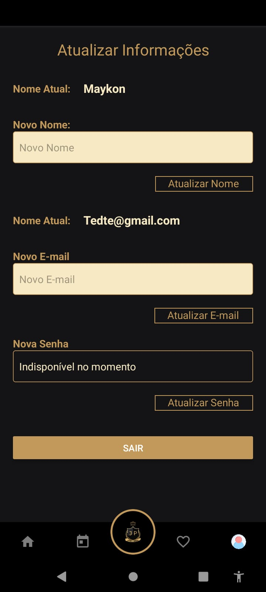
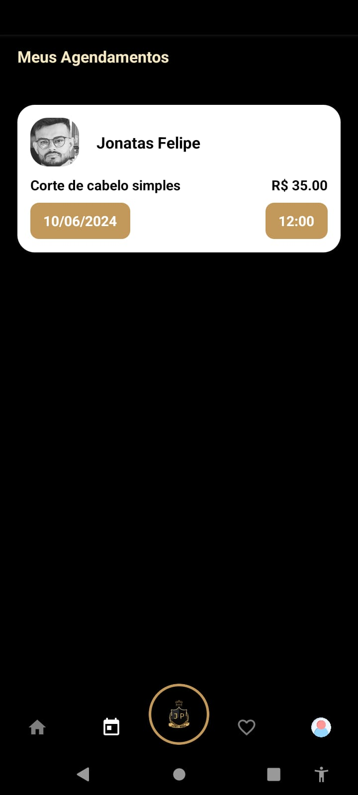
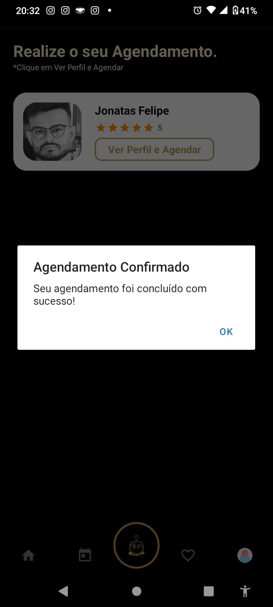
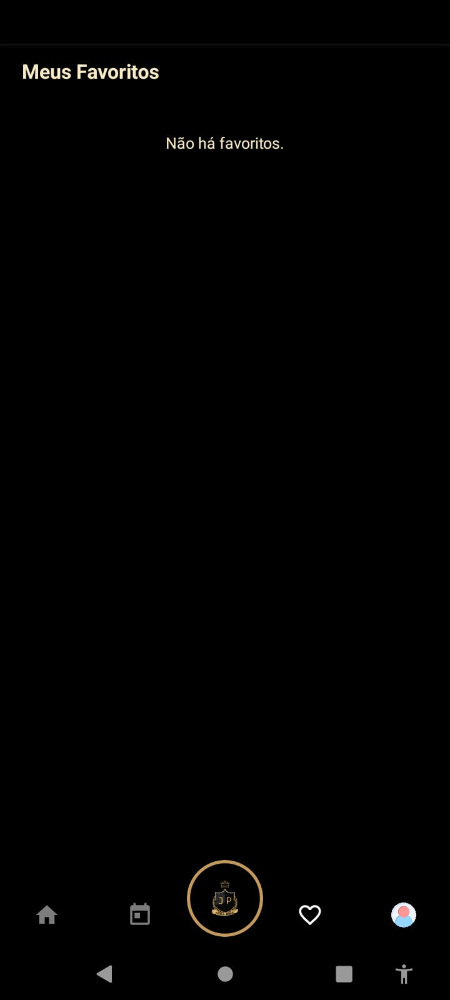

# Evidências de Testes de Software

## API

### 01 - Login/Cadastro

#### **1.1 - Verificar se o e-mail informado ao se cadastrar no sistema é existente**

<figure>
    
    <figcaption>Figura 01 - Evidência e-mail cadastrado existente.</figcaption>
</figure>

#### **1.2 - Verificar se o cadastro é realizado corretamente no sistema**

<figure>
    
    <figcaption>Figura 02 - Evidência e-mail cadastrado com sucesso.</figcaption>
</figure>

#### **1.3 - Verificar se o  sistema permite somente usuários cadastrados autenticarem na plataforma**

##### **1.3.1 - Evidencia de falha no acesso, com usuários não cadastrados**

<figure>
    
    <figcaption>Figura 02 - Evidência e-mail cadastrado com sucesso.</figcaption>
</figure>

##### **1.3.2 - Evidencia de sucesso no acesso, com usuários cadastrados**

<figure>
    
    <figcaption>Figura 03 - Tela de evidência de usuário cadastrado com sucesso.</figcaption>
</figure>

## FRONT-END

### 02 - Login/Cadastro

#### **2.1 - Verificar se a exbição da tela de login está correta**

<figure>
    
    <figcaption>Figura 04 - Tela de evidência exibição da tela de login.</figcaption>
</figure>

#### **2.2 - Verificar se a tela de cadastro está sendo exibida sem nenhum problema**

<figure>
    
    <figcaption>Figura 05 - Tela de evidência exibição da tela de cadastro.</figcaption>
</figure>

#### **2.3 - Verificar se a tela de Perfil está sendo exibida corretamente**

<figure>
    
    <figcaption>Figura 06 - Tela de evidência exibição da tela de perfil.</figcaption>
</figure>

  Com erro no menus ainda.

#### **2.4 - Verificar se a tela do barbeiro está retornando os serviços e valores corretamente**

<figure>
    
    <figcaption>Figura 07 - Tela de evidência exibição do perfil do barbeiro.</figcaption>
</figure>

##### **2.4.1 - Exibição da Tela de Perfil dos Barbeiros Cadastrados**

###### **2.4.1.1 - Perfil 01**

<figure>
    
    <figcaption>Figura 08 - Tela de evidência exibição do perfil 01.</figcaption>
</figure>

###### **3.1 - Tela Home**

<figure>
    
    <figcaption>Figura 08 - Tela de evidência exibição do Home.</figcaption>
</figure>

###### **4.1 - Tela Meus agendamentos**

<figure>
    
    <figcaption>Figura 08 - Tela de evidência exibição do Agendamento.</figcaption>
</figure>

###### **5.1 - Tela Lista de serviços**

<figure>
    
    <figcaption>Figura 08 - Tela de evidência exibição do Lista de serviços.</figcaption>
</figure>

###### **5.1 - Tela Lista de serviços**

<figure>
    
    <figcaption>Figura 08 - Tela de evidência exibição do Lista de serviços.</figcaption>
</figure>

###### **5.1.1 - Tela Lista de horarios disponiveis**

<figure>
    
    <figcaption>Figura 08 - Tela de evidência exibição do Lista de horarios.</figcaption>
</figure>

###### **5.1.2 - Tela agendamento confirmado**

<figure>
    
    <figcaption>Figura 08 - Tela de evidência exibição do confirmação de horarios.</figcaption>
</figure>

###### **5.1.2 - Tela agendamento confirmado**

<figure>
    
    <figcaption>Figura 08 - Tela de evidência exibição de Favoritos.</figcaption>
</figure>

###### **6.1 - Tela agendamento Perfil**

<figure>
    
    <figcaption>Figura 08 - Tela de evidência exibição de perfil.</figcaption>
</figure>
