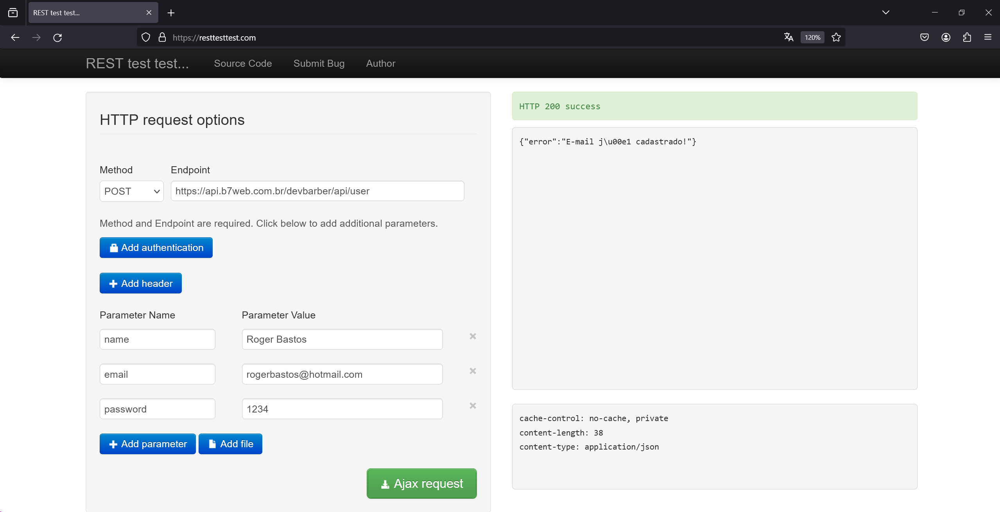
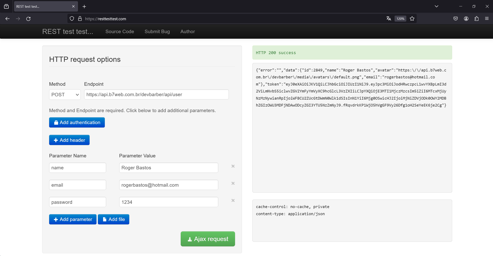
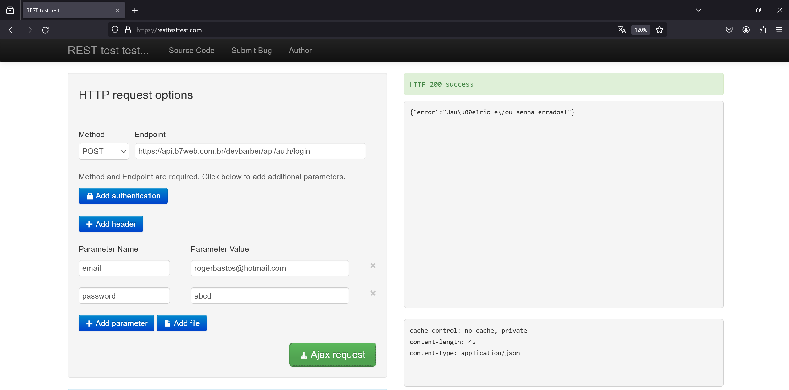

# Evidências de Testes de Software

## API

### 01 - Login/Cadastro

#### **1.1 - Verificar se o e-mail informado ao se cadastrar no sistema é existente**

<figure>
    
    <figcaption>Figura 01 - Evidência e-mail cadastrado existente.</figcaption>
</figure>

#### **1.2 - Verificar se o cadastro é realizado corretamente no sistema**

<figure>
    
    <figcaption>Figura 02 - Evidência e-mail cadastrado com sucesso.</figcaption>
</figure>

#### **1.3 - Verificar se o  sistema permite somente usuários cadastrados autenticarem na plataforma**

##### **1.3.1 - Evidencia de falha no acesso, com usuários não cadastrados**

<figure>
    
    <figcaption>Figura 02 - Evidência e-mail cadastrado com sucesso.</figcaption>
</figure>

##### **1.3.2 - Evidencia de sucesso no acesso, com usuários cadastrados**

<figure>
    
    <figcaption>Figura 03 - Tela de evidência de usuário cadastrado com sucesso.</figcaption>
</figure>

## FRONT-END

### 02 - Login/Cadastro

#### **2.1 - Verificar se a exbição da tela de login está correta**

<figure>    
    <video controls width="70%">
    <source src="img/Testes/Registros de testes jun24/2.1 - 2.2 - Cadastro e Login.mp4" type="video/mp4">
    Seu navegador não suporta a reprodução de vídeos.
</video>
    <figcaption>Figura 04 - Tela de evidência exibição da tela de login.</figcaption>
</figure>

#### **2.1.1 - Verificar se a exbição da tela de login verifica os dados inseridos**

<figure>
   <video controls width="70%">
    <source src="img/Testes/Registros de testes jun24/2.1.1 - Login validando dados.mp4">
    Seu navegador não suporta a reprodução de vídeos.
</video>
    <figcaption>Figura 05 - Tela de evidência exibição da tela de login validando dados.</figcaption>
</figure>

#### **2.2 - Verificar se a tela de cadastro está sendo exibida sem nenhum problema**

<figure>
   <video controls width="70%">
    <source src="img/Testes/Registros de testes jun24/2.1 - 2.2 - Cadastro e Login.mp4" type="video/mp4">
    Seu navegador não suporta a reprodução de vídeos.
</video>
    <figcaption>Figura 06 - Tela de evidência exibição da tela de cadastro.</figcaption>
</figure>

  

#### **2.2.1 - Verificar se a tela de cadastro verifica os dados inseridos**

<figure>
    <video controls width="70%">
    <source src="img/Testes/Registros de testes jun24/2.2.1 - cadastro validando dados.mp4" type="video/mp4">
    Seu navegador não suporta a reprodução de vídeos.
</video>
    <figcaption>Figura 07 - Tela de evidência exibição da tela de cadastro validando dados.</figcaption>
</figure>

### **2.3 - Verificar se a tela de Perfil está sendo exibida corretamente**

<figure>
    <video controls width="70%">
    <source src="img/Testes/Registros de testes jun24/2.3 - atualizando nome usuario email e senha.mp4" type="video/mp4">
    Seu navegador não suporta a reprodução de vídeos.
</video>
    <figcaption>Figura 08 - Tela de evidência exibição da tela do perfil com atualização de dados.</figcaption>
</figure>

#### **2.4 - Verificar se a tela do barbeiro está retornando os serviços e valores corretamente**

<video controls width="70%">
    <source src="img/Testes/Registros de testes jun24/2.4 - validando disponibilidade de horarios.mp4" type="video/mp4">
    Seu navegador não suporta a reprodução de vídeos.
</video>
    <figcaption>Figura 09 - Tela de agendamento validando disponibilidade de datas.</figcaption>
</figure>

#### **2.5 - Verificar se a funcionalidade de favoritar o barbeiro está funcionando corretamente**

<video controls width="70%">
    <source src="img/Testes/Registros de testes jun24/2.5 - favoritando barbeiro.mp4" type="video/mp4">
    Seu navegador não suporta a reprodução de vídeos.
</video>
    <figcaption>Figura 10 - Tela de agendamento validando o botão para adicionar um barbeiro como favorito.</figcaption>
</figure>

#### **2.6 - Verificar se a tela de favoritos está retornando os barbeiros favoritados corretamente**

<video controls width="70%">
    <source src="img/Testes/Registros de testes jun24/2.6 - desfavoritando barbeiro.mp4">
    Seu navegador não suporta a reprodução de vídeos.
</video>
    <figcaption>Figura 11 - Tela de agendamento validando o botão para adicionar um barbeiro como favorito.</figcaption>
</figure>

#### **2.7 - Verificar se a tela de agendamento está retornando os serviços e valores corretamente e concluindo o agendamento**

<video controls width="70%">
    <source src="img/Testes/Registros de testes jun24/2.7 - 2.8 - Realizando Agendamento e verificando o historico.mp4" type="video/mp4">
    Seu navegador não suporta a reprodução de vídeos.
</video>
    <figcaption>Figura 12 - Tela de agendamento validando disponibilidade de datas e concluindo agendamento.</figcaption>
</figure>

#### **2.8 - Verificar se a tela de historico apresenta os agendamentos realizados pelo cliente**

<video controls width="70%">
    <source src="img/Testes/Registros de testes jun24/2.7 - 2.8 - Realizando Agendamento e verificando o historico.mp4" type="video/mp4">
    Seu navegador não suporta a reprodução de vídeos.
</video>
    <figcaption>Figura 13 - Tela de historico mostrando os agendamentos realizados pelo cliente</figcaption>
</figure>
